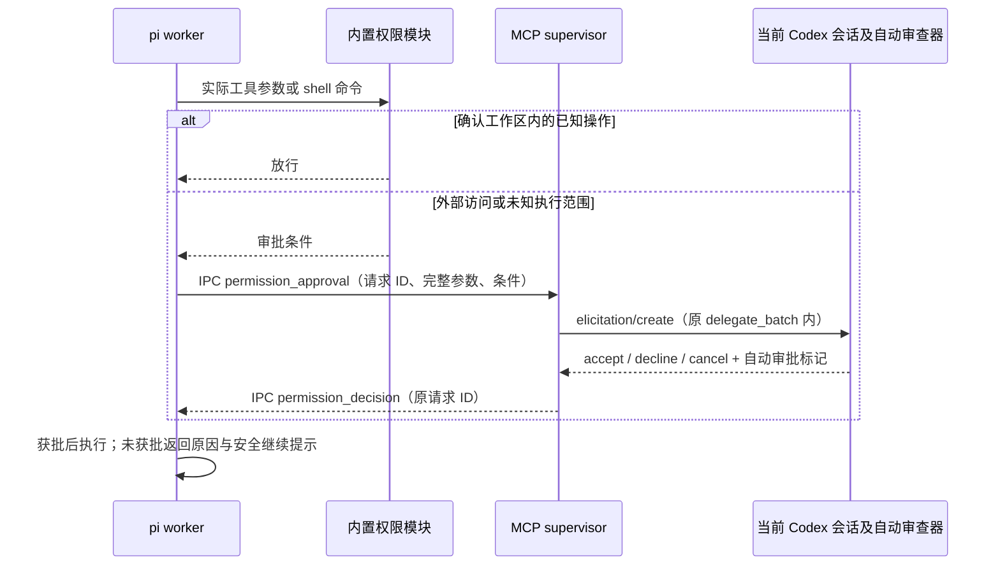

# 技术参考

[返回使用指南](../../../../README.md)

按需查阅模型配置、任务契约、审批协议和监控实现。常用操作见 README。

- [模型配置](#模型配置)
- [任务与通信](#任务与通信)
- [配置继承与执行约定](#配置继承与执行约定)
- [工作区权限与 Codex 自动审批](#工作区权限与-codex-自动审批)
- [生命周期与边界](#生命周期与边界)
- [监控与线程绑定](#监控与线程绑定)

## 模型配置

### 直接修改默认模型和思考强度

编辑 `~/.pi/agent/settings.json`，合并以下字段。`my-provider` 和 `my-model-id` 是占位符，替换为 pi `/model` 中对应的供应商 ID、模型 ID，或下面自定义模型配置中的实际值：

```json
{
  "defaultProvider": "my-provider",
  "defaultModel": "my-model-id",
  "defaultThinkingLevel": "high"
}
```

| 字段 | 含义 |
| --- | --- |
| `defaultProvider` | 供应商的精确 ID；自定义服务时对应 `models.json` 中 `providers` 下的键 |
| `defaultModel` | 该供应商下模型的精确 `id`，不是界面显示名；不额外拼接供应商前缀 |
| `defaultThinkingLevel` | 全局默认思考强度；接受 `off`、`minimal`、`low`、`medium`、`high`、`xhigh`、`max` |
| `modelThinkingLevels` | 可选的模型专属强度映射，键为精确的 `供应商ID/模型ID`；优先于全局默认值 |

例如，全局默认 `medium`，但当前选中的模型固定使用 `high`：

```json
{
  "defaultProvider": "my-provider",
  "defaultModel": "my-model-id",
  "defaultThinkingLevel": "medium",
  "modelThinkingLevels": {
    "my-provider/my-model-id": "high"
  }
}
```

worker 的实际解析顺序是：模型专属值 → 全局默认值 → 锁定版本 SDK 的默认值 `medium` → 按模型能力调整。因此，只修改 `defaultThinkingLevel`，已有的模型专属值仍然优先。

要统一强度，需要同时调整或移除对应映射。非推理模型或不支持某档位的模型可能得到不同的有效值，monitor 会显示实际生效的强度。

全局值和模型专属映射均校验上述档位。

`max` 是否实际可用仍由模型能力决定。

### 自定义供应商或 API 地址

使用已经可用的 pi 内置供应商时可以跳过此节。自定义服务需在 `~/.pi/agent/models.json` 中添加定义，再用 `settings.json` 选中它。例如：

```json
{
  "providers": {
    "my-provider": {
      "baseUrl": "https://YOUR_API_HOST/v1",
      "api": "openai-completions",
      "apiKey": "$PI_SUBAGENTS_API_KEY",
      "models": [
        {
          "id": "my-model-id",
          "name": "我的子代理模型",
          "reasoning": true,
          "input": ["text"],
          "contextWindow": 128000,
          "maxTokens": 8192
        }
      ]
    }
  }
}
```

这是需替换的配置模板：地址、模型 ID、上下文长度、最大输出和推理能力都应按服务实际能力填写。`api` 也必须匹配服务协议。

此例是 OpenAI Chat Completions 兼容协议，Responses 或 Anthropic Messages 服务需要使用对应的 pi 协议标识。模型必须支持工具调用。

`reasoning: true` 只是声明能力，不能让不支持推理的模型获得该能力。协议及能力字段见 [pi 自定义模型文档](https://pi.dev/docs/latest/models)。

`"$PI_SUBAGENTS_API_KEY"` 表示读取同名环境变量，`$` 不能省略，否则该字符串会被当成字面量 key。由启动 Codex 的环境提供此变量，并在 MCP 配置表中增加：

```toml
env_vars = ["PI_SUBAGENTS_API_KEY"]
```

该行应放在 [MCP 配置](../../../../README.md#mcp-配置)的 `[mcp_servers.co-pi]` 表中，用于把变量转发给 MCP 服务。只在另一终端设置环境变量不会改变已启动 Codex 的环境。

通过桌面启动 Codex 时，也需要确保它能获得该变量。若使用 pi `/login` 保存的凭据，可省略示例中的 `apiKey` 字段。

不要在 `settings.json` 或仓库内填写明文密钥。

### 自定义配置目录与生效时机

本项目默认固定读取系统用户目录下的 `.pi/agent`。如果你的 pi 使用 `PI_CODING_AGENT_DIR` 改过目录，需要在 MCP 的 `args` 中显式指定同一个目录，例如：

```toml
args = ["E:/gitProjects/codex-subagents/dist/cli.js", "--agent-dir", "E:/pi-config/agent"]
```

此时会读取 `E:/pi-config/agent/settings.json`、`auth.json` 和 `models.json`。给 pi CLI 配置这套目录时，在 Git Bash 使用 `PI_CODING_AGENT_DIR='E:/pi-config/agent' ./node_modules/.bin/pi`。

每个新 worker 启动时重新加载设置。

已运行的 worker 不会中途切换模型。为保证一批任务使用一致配置，请在上一批全部结束后修改设置，再提交下一批。修改 MCP 启动参数或环境变量后，需要重新连接 MCP / 重启 Codex。worker 不合并目标项目的 `.pi/settings.json`，所以修改项目级模型设置不会改变这些默认值。

## 任务与通信

### 协作流程：worker 交接，主模型收尾

当前采用一次委派、最终交接、主模型收尾的协作方式。worker 尽力完成职责范围内的任务。

主模型在执行期间推进自己的独立工作，收到整批交接后负责核对结果、补齐剩余工作、集成与最终验证。

1. 派发与执行：主模型明确任务边界、文件归属和验收条件。worker 活跃期间，可通过 `send_message` 修正要求或追加已授权工作。
2. 最终交接与退出：worker 提交有效 handoff，处理完已接收的消息并进入静止状态后，释放内存会话并退出进程。`completed`、`partial`、`blocked` 都是本次 worker 任务的终态，不会保留原会话等待验收或追问。
3. 主模型收尾：`partial` 表示还有未完成项，`blocked` 表示存在阻塞，均不能当作成功。主模型结合 `verification`、`evidence`、`unresolved` 和 `nextSteps` 检查实际成果，在已有授权内补齐可完成的工作；无法解除的阻塞应如实报告。
4. 失败后主模型接管：worker 进入 `failed` 终态后，包括模型调用重试耗尽的情况，主模型必须接手剩余已授权工作，沿用自己的当前上下文和此前独立任务的成果，不继承或恢复 worker 的完整会话。先核实已有文件改动及交接证据；即使没有有效 handoff，也不能假定 worker 没做过任何修改。不得自动重新委派失败任务、重跑整批或切换 worker 模型。无法解除的阻塞应如实报告，用户取消或暂停时遵循用户要求。
5. 必要时重新委派：有效交接后，额外调查或新增的独立工作仍可在当前批次结束后，用新的 `requestId` 创建任务，并附上原 handoff、相关文件、问题和验收条件。此路径不用于自动重派 `failed` 任务。新 worker 不继承原会话的完整上下文；不要未经核查重跑已经完成的工作。

这种分工将验收、少量补齐和整体集成集中在主模型，减少为收尾反复派发任务、重建上下文的需要。`partial` 是如实交接的出口，不是允许 worker 提前放弃职责的理由。

实际 token、时间与费用仍取决于任务和模型，没有固定节省比例。

主 agent 完成独立工作后，继续等待原委派调用，不频繁查状态、读日志或发送催促消息。通过 `functions.exec` 调用时，必须 await 工具并用 `text(result)` 输出结果。取得异步句柄后，在同一句柄上等待完成。

最终 handoff 作为工具结果进入主 agent 上下文。进度通知不保证进入模型上下文，不能替代最终结果。无需更改 Codex 主 agent 的模型设置。

### 工具与执行中通信

| 接口 | 用途 |
| --- | --- |
| `delegate_batch` | 提交 1–4 个任务，等待整批收尾后返回 handoff；默认并发 3 |
| `send_message` | 给活跃 worker 补充新要求；支持 `steer`、`followUp`、消息 ID 去重和分阶段回执 |
| `read_handoff` | 再次读取当前连接已完成批次的交接；不是状态查询接口 |

源码中的参数示例见 [batch.json](../../../../examples/batch.json)。每项任务包含 `id`、`title`、`instruction`、`acceptance` 和可选 `mode`，默认 `coding`。顶层 `context` 承载主任务背景、文件分工和已有授权。`workspace` 必须是绝对路径。一个 MCP 连接同时执行一批，批内超过并发上限的任务排队。

并发数通过 `--parallelism 1..4` 设置。多个编码 worker 共用工作区，派发时要明确文件所有权。

插件不会自动隔离 Git 分支。

补充消息示例：

```json
{
  "batchId": "my-batch",
  "taskId": "worker-1",
  "messageId": "correction-1",
  "mode": "steer",
  "message": "Additional acceptance criterion: cover empty input and report the result in your handoff."
}
```

`mode` 默认 `steer`：在 SDK 的工具边界参与当前任务，不会强行中断正在执行的工具。`followUp` 等当前轮结束后再处理。`messageId` 可省略，由服务生成。

需要重试传输时应自行指定并复用，同任务下相同 ID、相同内容与模式不会重复注入，不同参数会报 `message_id_conflict`。每项任务最多接收 128 条消息。

`followUp` 只适用于仍在接收消息的 worker，不会恢复已退出的会话。 worker 关闭过程中发送新消息会被拒绝。

任务已进入终态时，`send_message` 返回 `task_already_finished`。主模型拿到最终交接后，应按上述收尾或重新委派流程处理。

回执中的 `received` 仅表示 worker 收到。

`accepted` 表示 SDK 通过输入处理（扩展也可能消费消息）。

`queued` 表示 SDK 已入队。

`delivered` 表示观察到带对应 ID 的用户消息进入会话。这些状态都不表示模型已理解或执行完成。 最终结果仍以 handoff 为准。`rejected`、`cancelled`、`unknown` 分别表示拒绝、取消或无法确认。首次调用最多等待 5 秒取得 SDK 回执。

超时返回 `unknown`，不自动重发。扩展消费/改写消息后无法关联、worker 提前退出时，也会保留明确的未知状态。后续状态由 monitor 展示，主 agent 不应轮询回执。

通信有三个独立出口：

1. worker → supervisor：Node IPC 发送就绪信息、5 秒心跳、工具事件、公开进展、结构化交接。每个任务运行在独立 Node 进程和 pi 会话中。
2. supervisor → monitor / MCP 客户端：monitor 读取原子替换的状态快照，缓存未变化文件的解析结果；订阅了 `progressToken` 的 MCP 调用仅在阶段或摘要变化时收到合并后的状态通知，心跳与执行详情保留在 monitor，不进入最终工具结果。
3. supervisor → 主 agent：原 `delegate_batch` 调用结束时返回全部任务的终态和 handoff。失败任务有明确的运行时错误码，不伪造 worker 总结。

MCP progress 不是向主 agent 主动追加消息的机制。 主模型应等待原调用。

宿主有异步调用包装器时，可以继续独立工作，随后续接原句柄。本项目不会修改 Codex harness，也不保证靠工具描述完全消除模型主动查看日志的行为。

worker 使用 `report_progress` 上报公开进展，使用 `submit_handoff` 提交针对原任务的总结。工具参数和运行时均校验交接，规则如下：

| 字段 | 是否必填 | 内容约束 |
| --- | --- | --- |
| `status` | 是 | `completed`、`partial` 或 `blocked` |
| `summary` | 是 | 非空字符串 |
| `changes` | 是 | 字符串数组，可为 `[]` |
| `verification` | 是 | 数组，可为 `[]`；每项必须有 `action`、`result`、`detail`，结果为 `passed`、`failed` 或 `not_run` |
| `evidence` | 是 | 数组，可为 `[]`；每项必须有 `path`、`note`，只有正整数 `line` 可省略 |
| `unresolved` | 是 | 字符串数组，可为 `[]`；`completed` 时必须为空 |
| `nextSteps` | 是 | 字符串数组，可为 `[]` |

空数组表示该项没有内容，不能用省略字段或 `null` 代替。未知字段、类型错误、长度超限、状态与未解决项矛盾也会被拒绝。每段文本最多 2,000 字符，证据路径最多 500 字符。

各数组最多 20 项（`nextSteps` 最多 10 项），整份交接最多 32,000 UTF-8 字节。结构校验不等于事实核验，未执行的检查应记录 `not_run`，不能为了通过校验捏造证据。

无效提交向 worker 返回 `handoff_validation_failed`，列出问题字段与约束，并要求补齐后再次调用 `submit_handoff`，不会自动补空字段或把无效交接交给主 agent。模型停止但没有有效交接时，追加一次只允许交接工具的总结轮次。

仍缺失则报告 `handoff_missing`，不无限追加轮次，也不把最后一条聊天文本冒充交接。提交后如继续工作、接收新用户消息或尝试提交另一份交接，旧交接失效。

最新提交被拒绝时也不会回退交付旧结果。

快照写入串行异步执行，只处理变化或需要更新心跳的批次。

终态快照落盘后才返回交接，不再周期性重写历史批次。Windows 短暂文件占用会有限退避重试，持续失败仍返回 `state_write_failed`。常规 handoff 建议控制在约 4,000 字符，保留必要证据和未解决项。

初始化说明的动态路径放在固定说明末尾。这些措施减少上下文增量与重复通知。任务详情中的缓存用量属于 pi worker。

底部的主 agent cache-hit 独立读取 Codex 线程用量，两者不混算。

只有 SDK 发出 `agent_settled`、输入队列清空、压缩和重试结束、交接通过校验且 worker 正常退出后，任务才转为交接指定的终态。`agent_end` 可能随后继续重试或处理队列，不作为完成信号。`completed` 不允许同时声明未解决项。

`partial`、`blocked`、取消与异常均以 `isError=true` 标记整批工具结果，同时保留其他已成功任务的交接。证据来自 worker，当前版本不自动核验引用行号或文件内容，主 Agent 仍负责验收。

## 配置继承与执行约定

执行时遵循以下约定：

- `settings.json` 加载为内存副本；模型缺失时直接失败，避免静默选择其他供应商。全局的 retry、compaction、skills、extensions 等仍交给 pi 资源加载器处理。
- worker 不回写全局设置。会话使用内存存储，不持久化完整模型会话；监控快照会保留有界、脱敏后的 SDK 思考文本供展开查看。认证刷新和模型缓存仍遵循 pi SDK 的行为，模型目录缓存使用标准 `~/.pi/agent/models-store.json`（`--agent-dir` 会一并改变目录）。
- 初始化先通过 `createAgentSessionServices` 加载资源并注册扩展供应商，再解析指定模型；通过 `bindExtensions` 以无交互界面的模式执行 `session_start`。扩展加载、启动或运行失败会报告固定错误码，不输出原始异常内容。需要交互确认或自定义 TUI 的扩展不能依赖 monitor 提供界面。
- 编码模式继承 pi 的 `defaultTools` 和扩展工具，同时保留 `report_progress`、`submit_handoff`。未配置 `defaultTools` 时使用 pi 默认内置工具。扩展不得覆盖内置工具与通信保留名。
- `bash` 经过内置路径/AST 检查，仅外部访问或未知范围进入 Codex 自动审批。独立 `powershell` 工具禁用。
- `read-only` 显式启用 read、grep、find、ls 和两项通信工具，不启用扩展注册的工具。扩展钩子仍是受信代码，不构成安全隔离。
- Windows 要求设置文件中的 `shellPath` 为 `C:\Git\bin\bash.exe`，启动时验证 Git Bash 与 Git。其他平台保留 pi 配置的 shell，不检查 Windows 路径。

### 所有平台的 system instruction

[src/instructions.ts](../../../../src/instructions.ts) 保存英文 worker 指令和授权边界：共享/生产系统、不可恢复删除、敏感文件、敏感 Git 操作。任务模板、补充消息模板、MCP 工具说明和 skill 同样使用英文。

用户任务内容原样传递，界面及本使用文档保留中文。worker 通过 SDK 的 `appendSystemPrompt` 为每个任务追加，仅对适用平台和可用工具添加条件指令，无需用户复制到 `AGENTS.md` 或全局 pi prompt 文件。

- 删除前核实目标；不可恢复删除或删除非本会话创建的文件需要明确授权，优先可恢复方式。
- shell 初始化文件、SSH/GPG、pi 认证、私钥与其他凭据默认禁止读写。诊断仅检查存在性；用户明确授权后的读取输出须脱敏，修改须先说明具体操作并获授权。
- 推送、历史重写、丢弃改动等 Git 操作须先说明命令、目标和影响，并取得明确授权；不能擅自绕过钩子。

Windows 再追加 Git Bash/POSIX 语法要求。

所有平台仅在检测到 UV 时追加使用 `uv run` 执行 Python 的指令。默认仍允许修改任务目录内的普通代码文件，且保留已有 handoff 和通信约定。这些是模型指令，不能视为文件系统沙箱或操作拦截器。

### 工作区权限与 Codex 自动审批

从 [pi-permission-system](https://github.com/gotgenes/pi-packages/tree/main/packages/pi-permission-system) 33.0.5 提取并适配 Bash 解析器初始化、缓存和路径规范化模块，代码和 MIT 许可位于 [src/vendor/pi-permission-system](../../../../src/vendor/pi-permission-system/README.md)。不依赖完整权限包或运行时 TypeScript 加载器。MCP worker 通过项目自身的工具入口落实以下规则：

| 操作 | 处理 |
| --- | --- |
| 内置 read/write/edit/grep/find/ls，目标确认在工作区内 | 无需自动审批 |
| 工具目标位于工作区外，包括读取 | Codex 自动审批 |
| 简单 pwd/echo/printf/cat/head/tail/wc/ls，路径确认在工作区内 | 无需自动审批 |
| Git（包括 git rm）、Python/Node、脚本、复杂 shell、其他程序或扩展工具 | 范围未知，Codex 自动审批 |
| 审批拒绝、审批超时或无有效自动审批能力 | 不执行此次调用；把原因和继续提示返回 worker，让其尝试安全替代方案 |
| 任务取消或连接关闭 | 停止任务，不启动替代操作 |

工具执行前检查实际路径，采用 pi 自身的路径转换。

补查不存在的新文件的最近存在祖先，避免通过工作区内 junction/symlink 向外部创建文件。Bash 检查包含 shellCommandPrefix 的实际命令。获批操作只执行本次调用，不缓存会话或命令前缀授权。

同一工具调用的多个询问合并为一次审批。monitor 显示审批状态，审批事件不另存完整工具参数。

审批未通过时，工具结果包含 `continue, try another safer way.`，monitor 显示“未获批准”，不会仅因该拒绝把整个任务标为失败。worker 可继续执行已有授权范围内的安全操作。

不得换工具绕过拒绝，新的外部访问仍须重新审批。确实没有可行的授权替代方案时，worker 应如实交接 `blocked`，不能伪造完成。

内置策略固定工作区边界，不加载上游配置、YOLO、会话授权或基础设施路径豁免。Bash AST 只对已识别的单条简单命令、支持的选项和字面量路径放行。

解析失败、复合结构、间接输入、无法映射的 Git Bash 路径均进入审批。含 `..` 的 shell 路径、反斜杠续行、未可靠解码的转义也交给审批，避免词法路径和实际执行路径不同。

因此部分实际安全的父目录路径也会请求审批。没有重复注册标准扩展，也不改动单独运行 pi 的权限配置。



在本项目已验证的 Codex CLI 0.155.1 中，可用 `codex --approve-for-me` 启动，或合并以下配置。它们是 TOML 顶层设置，放在任何 `[表名]` 之前，不要写进 `[mcp_servers.co-pi]`。

安装器不会代改。其他版本或受组织管理的环境应核对其可用权限选项与策略：

```toml
approval_policy = "on-request"
approvals_reviewer = "auto_review"
sandbox_mode = "workspace-write"
```

服务器通过原 `delegate_batch` 调用发送 `elicitation/create`。请求使用以下字段：

| 字段 | 值 / 内容 |
| --- | --- |
| `mode` | `form`，表单为空对象 |
| `codex_request_type` | `approval_request` |
| `codex_approval_kind` | `mcp_tool_call` |
| `codex_strict_auto_review` | `true` |
| `codex_sensitive_action` | `true` |
| `tool_params` | 完整工具参数和审批条件 |
| `callId` | 原样关联宿主提供的调用 ID |

只有响应同时满足 `action: accept`、`content` 为空对象、`_meta.approvals_reviewer: auto_review`，才会放行。

缺失标记、协议错误或超过两分钟均不执行。迟到响应不能恢复已取消的操作，也不能用于其他请求。

该元数据协议不是 MCP 通用标准。已用本机 Codex CLI 0.155.1、隔离配置和本地模拟审查模型验证 CLI → 本项目 MCP → pi SDK 的完整链路，分别覆盖 Bash 和 write 的批准与拒绝，确认触发 autoApprovalReview 且拒绝后未写入外部文件。真实模型判断质量和其他宿主版本仍需各自验证。

普通 MCP 表单 accept 不足以放行。

获批脚本及子进程以宿主权限运行，子进程不会逐个审批。

扩展初始化、事件处理和扩展自身代码可绕过工具入口。检查与执行之间也无法排除其他进程更换链接。需要对任意代码强制限制文件系统时，仍须另加容器、受限用户或操作系统沙箱。工作区内的权限放行不取代用户对敏感文件、删除或生产操作的授权要求。

依据：[Codex Auto-review](https://learn.chatgpt.com/docs/sandboxing/auto-review)、[Codex MCP 审批测试](https://github.com/openai/codex/blob/75ec81c8623c0ca50b129de5a82521a23d37b726/codex-rs/core/tests/suite/guardian_mcp_elicitation.rs)、[pi 安全边界](https://github.com/earendil-works/pi/blob/main/packages/coding-agent/docs/security.md)。

## 生命周期与边界

`requestId` 在同一 MCP 连接内幂等：相同参数返回原执行结果，不再次运行。

同 ID 不同参数拒绝。重启后不具备跨连接幂等或断点恢复能力。MCP 断连、调用取消或进程收到终止信号会取消所属任务。

不会因为一个 worker 失败自动取消其他 worker。

单任务默认上限 30 分钟，可用 `--task-timeout-ms` 调整（最多 24 小时）。worker 连续 30 秒无 IPC 活动则视为无响应。取消时停止接收新消息、清空本地及 SDK 的 steer/followUp 队列，再中止 SDK。

3 秒仍未退出则尝试回收进程树。取消不撤销文件修改，任意 shell 命令自行脱离的外部进程不保证被回收。硬杀宿主不会恢复任务，monitor 在心跳过期后显示“连接失联·状态未知”。没有自动重跑整项收费任务或切换模型的降级路径。

单次请求的自动重试仍遵循 pi 设置。

编码模式按当前用户权限执行。工作目录、read-only 工具列表和提示不是操作系统级沙箱。

工具入口已接入上述路径检查与 Codex 自动审批。全局 pi 扩展属于用户信任的代码，能自行执行副作用。主 agent 应只传递已授权任务。

需要强隔离时，在容器或受限用户环境中运行本服务。

monitor 只读任务状态文件和 Codex 本地线程记录，不连接认证配置、不调用模型、不向 worker 输入指令。每个任务保留最近 200 条有界执行事件，旧事件计数明确显示。

完整 handoff 单独保留在快照内。状态文本去除终端控制字符并对常见令牌形式脱敏，但无法识别任意格式的秘密，因此状态目录仍应视为用户私有数据。任务指令与主任务上下文不写入快照，供应商原始错误正文不进入 MCP 或日志。

时间线显示公开 assistant 文本和工具中间结果，约 100ms 合并一次。

同一工具调用按 `toolCallId` 关联、覆盖累计输出，最终结果覆盖中间版本，避免重复堆叠。单条文本最多 4,000 字符。

thinking 事件保存 SDK 返回的非屏蔽文本累计快照，按 `t` 展开查看。

签名和 redacted 内容不采集。思考文本超过 4,000 字符时保留有界内容并提示截断。旧快照仍显示原有阶段记录，不会凭空补出思考正文。状态快照约 200ms 合并写入，monitor 每 500ms 刷新。

详情顶部显示压缩阶段、模型/摘要重试与倒计时、两类队列长度、token 用量、缓存读写、工具调用数、上下文占用和估算费用。压缩后尚无新模型用量时，上下文显示“未知”。费用由模型配置的价格计算，零费用也可能表示未配置价格。

这些不是供应商账单。消息回执可在详情中查看，Home 返回时间线顶部。

## 监控与线程绑定

同一状态目录的并发开窗请求会合并，已有交互监控时不再开窗，也不修改已有窗口的筛选条件。实例协调仅通过本机 `127.0.0.1` 连接传递身份和就绪状态，不传任务内容。

进程退出即释放占用，不向任务状态目录写锁文件。启动脚本位于系统临时目录，确认就绪或失败后清理。

快捷键上方显示 主 agent cache-hit：进度条、最近一次请求的缓存命中率，以及宽窗口下的缓存 / 输入 token 数。其下独立显示“监控线程”和“用量更新”：宽窗口显示固定线程完整 ID、本地日期时间、UTC 时区偏移和记录距今多久。

窄窗口保留线程首尾片段及本地月日时间。列表与详情页一致，高度至少 8 行时保留这些信息。

更低窗口优先显示任务正文。

需要完整 ID 时可使用 `--once`。

比例使用固定 Codex 线程记录中的 `last_token_usage.cached_input_tokens / last_token_usage.input_tokens`，不使用累计用量或 pi worker 的指标。它表示最近一条完整用量记录中的比例。

最新用量无效、输入为零、记录损坏或读取失败时显示 `—`，不能用旧值掩盖，真正零命中显示 `0.0%`。更新时间来自日志事件，不是 monitor 刷新时间。

没有新记录时保留原时间。无效时间显示“记录时间未知”，没有用量记录显示“尚无用量记录”。

状态目录绑定固定线程，不按最新活动或项目自动选线程。 服务端把身份存入 `<state-dir>/codex-thread.json`，相同目录可由同线程重用。

另一个线程尝试绑定会报 `state_thread_conflict`，不会覆盖旧绑定。monitor 从目录读取绑定，优先于所在终端的 `CODEX_THREAD_ID`。

显式 `--thread-id` 与绑定不一致也会拒绝。`--session` 只过滤 MCP 会话，与 Codex 线程 ID 不同。

旧目录没有绑定时，可由服务端以 `--state-dir <旧目录> --thread-id <正确ID>` 重启建立绑定。monitor 也支持显式 ID（其次是自身 `CODEX_THREAD_ID`）临时查看未绑定目录，但保持只读，不写绑定文件。三者都没有时只显示任务，缓存比例为 `—`，不会猜线程。新主线程应使用自己的状态目录。

不要把旧目录重新绑定给它。

```bash
# 服务端：绑定固定线程；配置 MCP 启动参数时采用相同参数
co-pi --state-dir '/实际状态目录' --thread-id '<Codex线程ID>'

# 外部终端：仅读取该目录绑定，无须猜测或传入线程 ID
cpi-monitor --state-dir '/实际状态目录'

# 旧目录尚未绑定时，也可明确指定 ID 查看
cpi-monitor --state-dir '/实际状态目录' --thread-id '<Codex线程ID>'
```

Codex 记录来自 `$CODEX_HOME/sessions` 和 `archived_sessions`，未设置时使用 `~/.codex`。

可用 `--codex-home <目录>` 覆盖。缓存用量首次立即查询，此后每 10 秒刷新。

任务快照仍每 500ms 更新。只查固定 ID 的日志，同 ID 多份文件时显示不可用，不按修改时间猜选。参照 `cache_hit.py`，每次固定文件长度、从尾部按 64KiB 块倒序读取，找到最新完整 `token_count` 就停止。

忽略尚未换行的尾部，无效最新用量不回退旧值。文件大小、身份及修改时间不变时复用结果，不重读正文。

大段新增输出不再分多轮追赶。日志正文不进入 MCP 结果或快照，也不调用模型。
