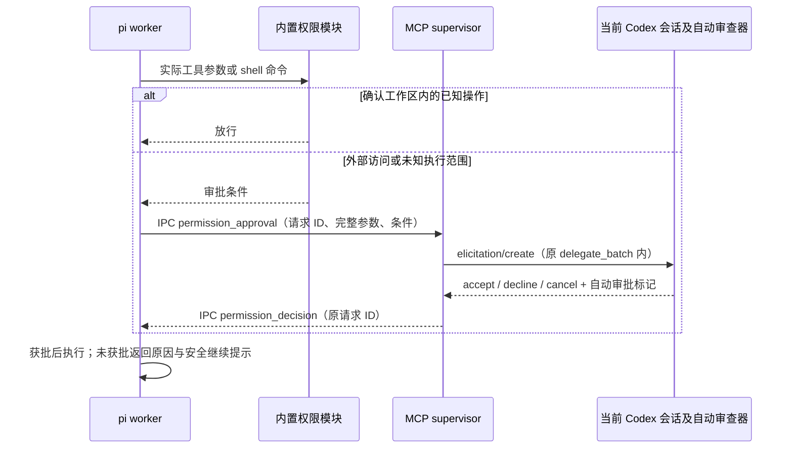

# co-pi

当前版本：**0.1.2**。

为 Codex 主 agent 提供基于 pi SDK 的独立子代理，以及只读终端监控器 `cpi-monitor`。当前接入方式是 **本地 stdio MCP 服务 + `co-pi` skill**，不需要单独部署 Web 服务或数据库。

## 特性概览

| 能力 | 当前行为 |
| --- | --- |
| 并行委派 | 每批 1–4 项任务，默认并发 3；独立 Node 进程和 pi 会话；支持编码与只读调查 |
| 清晰分工 | 任务包含完整需求、文件范围、验收条件和已有授权；主 agent 保留独立工作，随后收集原调用结果 |
| 执行中纠正 | `steer` / `followUp` 消息、消息 ID 去重、分阶段回执；回执与任务完成明确区分 |
| 结构化交接 | 七个必填字段、类型和长度校验、缺项反馈与重新提交；保留成功、部分完成、阻塞和运行错误 |
| 权限检查 | 工作区路径与 Bash AST 检查；外部访问及未知执行范围交给 Codex 自动审批；拒绝后可继续尝试安全替代方案 |
| 终端监控 | 任务列表、分类时间线、Markdown 公开输出、工具参数及结果、最终交接、思考阶段标记；不显示私有推理正文 |
| 用量与状态 | worker 模型、思考强度、token/cache、费用估算、上下文占用、压缩/重试和消息队列 |
| 主线程 cache-hit | monitor 读取 Codex 本地线程的最近一次请求用量，独立显示缓存比例；不调用模型、不让主 agent 轮询 |
| 配置继承 | 使用既有 pi 的供应商、认证、模型、思考强度及扩展；worker 不回写全局模型设置 |
| 生命周期 | 并发限制、任务超时、心跳、取消与进程回收、连接内请求幂等；不会静默重跑整项任务 |
| 轻量运行包 | 预编译 JS、固定版本 WASM、许可证及锁文件；用户只装运行依赖，保留源码开发安装路线 |
| 三平台入口 | Windows Git Bash / PowerShell 7、macOS、Linux 安装脚本；统一安装器、配置备份与 monitor 快捷命令 |

功能边界：worker 以宿主用户权限运行，工作目录和只读工具列表不构成 OS 沙箱；monitor 不提供聊天输入或审批界面；暂不支持跨 MCP 连接恢复任务、持久化完整 pi 会话或自动为每项任务创建 Git worktree。代码与工具结果会发送到你配置的 pi 模型服务。

## 阅读顺序

首次安装：**准备环境 → 选择源码或运行包 → 执行平台安装器 → 配置 pi → 接入 Codex 与技能 → 验证首个任务**。安装器完成不等于模型已配置。

- [安装前准备](#安装前准备)
- [旧名称迁移](#旧名称迁移)
- [取得源码或运行包](#取得源码或运行包)
- [各平台安装步骤](#各平台安装步骤)
- [安装器行为与参数](#安装器行为与参数)
- [配置 pi 的认证、模型与思考强度](#配置-pi-的认证模型与思考强度)
- [接入 Codex 并启动 monitor](#接入-codex-并启动-monitor)
- [更新或重装](#更新或重装)
- [目录用途与运行包构建](#目录用途与运行包构建)
- [任务与通信](#任务与通信)
- [配置继承与执行约定](#配置继承与执行约定)
- [生命周期与边界](#生命周期与边界)
- [开发验证](#开发验证)

## 旧名称迁移

项目、npm 包和 skill 统一使用 **`co-pi`**，版本仍为 `0.1.2`。名称对应关系如下：

| 入口 | 当前名称 | 兼容与迁移 |
| --- | --- | --- |
| npm 包 / 运行归档 | `co-pi` / `co-pi-0.1.2.tgz` | 原名 `codex-pi-subagents`；重新生成的归档使用新名，不代表已发布到 npm |
| MCP 服务及配置表 | `co-pi` / `[mcp_servers.co-pi]` | 原配置键为 `pi_subagents`，按安装器输出迁移同一个表，保留已有参数及环境变量 |
| skill | `$co-pi`，目录 `.agents/skills/co-pi/` | 更新项目或用户目录中原来的 `pi-subagents` 技能副本，并包含 `references/` |
| CLI | `co-pi` | npm `bin` 同时保留 `pi-subagents` 别名，两者指向 `dist/cli.js` |
| monitor / 状态数据 | `cpi-monitor` / `~/.cpi/state/` | 命令与数据路径保持兼容；旧安装器创建的启动脚本可正常更新 |

升级前先结束任务并关闭原 MCP 连接。重跑安装器后，将 Codex 中旧表名改为 `co-pi`，不要同时注册两个指向同一服务的表。旧表名只是宿主标签，保留它仍可启动原 JS 入口，但工具前缀会继续使用旧标签。安装器只输出配置，不会擅自修改用户的 Codex 配置。

技能名称没有自动别名：将已安装的旧技能目录备份到技能发现目录之外，再复制新的 `co-pi/`，重启 Codex 并使用 `$co-pi`。不要只改调用文字而保留旧的 `SKILL.md`。仓库内技能已改名，外部项目或用户目录中的副本需要自行同步。

GitHub 仓库地址和本地仓库目录尚未改名，因此文档中的 `codex-subagents` 克隆地址与路径仍有效；服务名称不要求安装目录也叫 `co-pi`。

## 安装前准备

### 通用依赖

| 项目 | 要求 | 何时需要 |
| --- | --- | --- |
| Node.js | **≥ 22.19.0**，选择与系统架构匹配的 [Node.js 发行版](https://nodejs.org/en/download) | 源码与运行包都需要；Codex 自带的运行环境不能代替本项目的 Node |
| npm | 随 Node.js 安装，终端内能运行 `npm --version` | 安装锁定依赖；无需另装全局 TypeScript |
| Bash | Windows 固定 `C:\Git\bin\bash.exe`；macOS/Linux 需要可运行的 Bash | 平台脚本及 worker shell；Windows 的独立 PowerShell 工具不启用 |
| Git | Windows 安装与 worker 启动均检查；其他平台在克隆/更新源码、任务使用 Git 时需要 | Windows 通过 [Git for Windows](https://gitforwindows.org/) 安装到 `C:\Git`；macOS/Linux 使用各自 Git 安装方式 |
| Codex CLI | 已安装、能启动并完成认证；审批功能还需宿主支持对应自动审批能力 | 按 [官方 Codex CLI 文档](https://learn.chatgpt.com/docs/codex/cli)选择平台安装方式，运行 `codex` 完成登录 |
| pi 模型服务 | 至少一个支持工具调用的可用模型，以及对应认证 | 必须在首次委派前配置；与 Codex 主模型的认证及费用分开 |
| UTF-8 终端 | 交互 monitor 需要 TTY；建议使用支持 Unicode 的字体 | Windows Terminal、macOS Terminal 或 Linux 终端；非交互输出用 `--once` |
| `tar` | 能解压 `.tgz` | 安装预编译运行包时需要；也可用其他归档工具解压 |

安装需要能访问 npm 源；下载源码/归档需要访问相应来源；执行任务需要能访问配置的模型服务。`rg`、`fd` 缺失时，锁定版本的 pi 会尝试从 GitHub 下载，离线环境应预先准备可用的 `rg` 和 `fd` 命令。Linux 某些发行版将 fd 命名为 `fdfind`，请确认 pi 能找到名为 `fd` 的可执行文件。

**UV 可选**：检测到 `uv --version` 可用时，为 worker 加入 Python 使用 `uv run` 的指令；不可用不阻止本插件安装。Python、Java、Docker、编译器等属于被委派项目的工具链，按任务需要另行准备。本插件的标准安装路径不要求全局安装 pi CLI、TypeScript、Rust、Cargo 或 DSH；依赖包在特殊平台上的原生构建需求以实际安装错误为准。

### 平台差异

| 环境 | 前置准备与路径约定 |
| --- | --- |
| Windows 原生 | 安装 Windows 版 Node.js/npm；**Git for Windows 必须安装到 `C:\Git`**。用 Git Bash 执行 Bash 示例；PowerShell 入口需要 **PowerShell 7 (`pwsh`)**，Windows PowerShell 5.1 不满足该入口要求。PowerShell 7 是可选入口，不替代 Git Bash。 |
| macOS | 安装匹配 Apple Silicon / Intel 的 Node.js/npm。需要 Git 时可通过 Apple Command Line Tools 或自己的包管理器安装；确认 `bash` 可用。保留 pi 原有 `shellPath`，无需填写 Windows 路径。 |
| Linux | 安装适配发行版和架构的 Node.js/npm、Bash；克隆源码还需 Git。发行版默认 Node 版本可能低于 22.19.0，务必检查。可用 Node 官方提供的安装方式或现有版本管理器。 |
| WSL | 在同一 WSL 发行版内按 **Linux** 流程安装 Node、Codex、pi 依赖和配置，使用 Linux 路径；不要混用 Windows 的 `node.exe`、安装目录或凭据目录。 |

Node/npm、Git、Codex 和任务工具必须出现在**启动 Codex 的环境**里。终端里可用而桌面或另一个终端里不可用时，重启该应用并检查 PATH；MCP 可使用 Node 的绝对路径。项目提供三平台分支测试；目前完成 Windows 本机安装及运行包验证，未宣称每种 macOS/Linux 发行版和 CPU 架构均已实机验收。

## 取得源码或运行包

先选一种；之后都运行同一个平台安装器。把安装目录放在用户可写、长期保留的位置，monitor 和 MCP 会引用这个位置。

| 安装方式 | 适用场景 | 安装器动作 |
| --- | --- | --- |
| 源码 | 开发、改代码，或尚未取得维护者生成的运行包 | `npm ci` → `npm run build`，使用 `package-lock.json` |
| 预编译运行包 | 只使用插件，无需本地编译 | 校验资源 → `npm ci --omit=dev`，使用 `npm-shrinkwrap.json` |

### 方式 A：源码

在 Git Bash / Bash 中进入用于存放项目的目录，然后运行：

```bash
git clone https://github.com/Cyli00/codex-subagents.git
cd codex-subagents
```

也可取得源码归档并解压，确认目录内有 `package.json`、`package-lock.json`、`src/` 和 `scripts/`。克隆默认分支不保证固定到 0.1.2；检查 `package.json` 中的版本。没有预编译包时可直接走源码路线，无需自行寻找未发布的 npm 包。

### 方式 B：预编译运行包

从维护者取得 `co-pi-0.1.2.tgz`；这是本项目构建脚本生成的产物，**不假定 npm 或 GitHub Releases 已发布它**。在 Git Bash / Bash 中执行，替换归档的实际路径：

```bash
mkdir cpi-runtime-0.1.2
tar -xzf '/path/to/co-pi-0.1.2.tgz' -C cpi-runtime-0.1.2 --strip-components=1
cd cpi-runtime-0.1.2
```

Windows Git Bash 可用 `C:/Users/你的用户名/Downloads/...tgz`；macOS/Linux 可用 `/Users/你的用户名/Downloads/...tgz` 或 `/home/你的用户名/Downloads/...tgz`。用图形工具解压时，进入同时包含 `package.json`、`npm-shrinkwrap.json`、`dist/`、`scripts/` 的目录；不要停在其外层。

运行包不包含 `node_modules`，首次安装仍需 npm 网络访问，也仍需 Node.js。它不提供 `npm run build`；缺失或损坏的运行文件应通过重新解压完整包恢复。

## 各平台安装步骤

以下命令均在刚取得的**项目根目录**执行。`--check` 只预检；下一条不带 `--check` 才会安装。安装器不代装 Node/Git/Codex，不登录模型服务。

### Windows：Git Bash

1. 安装 Node.js ≥ 22.19.0 和 Git for Windows（路径 `C:\Git`），按官方文档安装并登录 Codex；重新打开 Git Bash。
2. 确认环境：

```bash
node --version
npm --version
git --version
codex --version
/c/Git/bin/bash.exe --version
```

3. 从 Git Bash 进入项目目录（例如 `cd /c/tools/codex-subagents`），预检并安装：

```bash
bash scripts/install-windows.sh --check
bash scripts/install-windows.sh
```

4. 安装器会把 `shellPath: "C:\Git\bin\bash.exe"` 合并到所选 pi 的 `settings.json` 并备份原文件；随后继续下文的 pi 配置和 Codex 接入。**不要用仅含 shellPath 的文件覆盖原模型设置。**

可选 PowerShell 7 入口，在同一个项目目录运行：

```powershell
pwsh -NoProfile -File scripts/install-windows.ps1 --check
pwsh -NoProfile -File scripts/install-windows.ps1
```

两种入口调用同一个安装器，Windows 依赖安装和 worker shell 仍使用 Git Bash。PowerShell 中执行其他 Bash 示例时，请先切换到 Git Bash。

### macOS

1. 安装匹配芯片架构的 Node.js ≥ 22.19.0/npm，准备 Git/Bash，安装并登录 Codex；若用版本管理器，先在当前终端激活对应 Node 版本。
2. 进入项目目录，检查环境并安装：

```bash
node --version
npm --version
bash --version
git --version
codex --version
bash scripts/install-macos.sh --check
bash scripts/install-macos.sh
```

3. 继续 pi 配置和 Codex 接入。无需安装 Git for Windows、PowerShell 或填写 Windows shell 路径。默认 macOS 终端为 zsh 也可执行上述命令，安装脚本由显式的 `bash` 运行。

若 npm 全局命令目录不可写，指定用户目录并让当前终端能找到它：

```bash
bash scripts/install-macos.sh --bin-dir "$HOME/.local/bin"
export PATH="$HOME/.local/bin:$PATH"
```

`export` 只影响当前终端；长期 PATH 设置由用户按自己的终端环境管理，安装器不修改 shell 初始化文件。无需用 `sudo` 安装本项目。

### Linux / WSL

1. 准备 Node.js ≥ 22.19.0/npm、Bash，以及源码路线所需的 Git，安装并登录 Codex。使用 Node 版本管理器时先激活；WSL 中所有操作均在同一发行版内进行。
2. 进入项目目录，检查环境并安装：

```bash
node --version
npm --version
bash --version
git --version
codex --version
bash scripts/install-linux.sh --check
bash scripts/install-linux.sh
```

3. 继续 pi 配置和 Codex 接入。无需 Windows 的 `shellPath`；在无 TTY 的 SSH 命令、CI 或重定向环境中，用 `cpi-monitor --once`，交互监控需有终端。

全局命令目录不可写时，同样可指定用户目录：

```bash
bash scripts/install-linux.sh --bin-dir "$HOME/.local/bin"
export PATH="$HOME/.local/bin:$PATH"
```

## 安装器行为与参数

所有平台也可直接运行 `node scripts/install.mjs`，自动识别操作系统；支持从其他目录用脚本绝对路径调用，路径可以含空格。平台脚本会核对当前 OS，不能在 Linux 上运行 Windows 入口。

| 参数 | 默认值 / 行为 |
| --- | --- |
| `--check` | 检查环境、设置格式、快捷命令目标；运行包还检查必需资源及 WASM 哈希；不安装、不写配置 |
| `--agent-dir <目录>` | 默认 `~/.pi/agent`；所有后续 worker 应使用同一目录；不会自动读取 `PI_CODING_AGENT_DIR` 作为替代 |
| `--bin-dir <目录>` | Windows 默认 npm 全局 prefix；macOS/Linux 默认该 prefix 下的 `bin/`；指定目录应在 PATH 中 |
| `--help` | 显示安装器帮助 |

例如：

```bash
node scripts/install.mjs --check --agent-dir '/path/to/pi/agent' --bin-dir '/path/to/user/bin'
node scripts/install.mjs --agent-dir '/path/to/pi/agent' --bin-dir '/path/to/user/bin'
```

安装依次完成：

1. 检查 Node/npm、UV 和 pi `settings.json` 格式；Windows 运行指定 Git Bash 并检查 Git；检查快捷命令冲突和目录可写性。配置目录可以是链接，`settings.json` 文件自身必须是普通文件。
2. 源码安装依赖并编译；运行包验证文件与 WASM 后只安装生产依赖。此步失败不修改 pi 设置。
3. 必要时备份并合并 pi 设置。Windows 合并 `shellPath`；macOS/Linux 保留原 shell。只移除旧安装器注册的本项目完整权限扩展引用，保留用户独立安装的包及规则。原文件备份为 `settings.json.cpi-backup-<随机ID>`。
4. 注册 `cpi-monitor`；Windows 同时生成 Bash 启动脚本与 `.cmd`，macOS/Linux 生成可执行脚本。入口绑定本次 Node 与 `dist/monitor-cli.js` 的绝对路径，不覆盖其他工具管理的同名入口。
5. 输出 MCP 配置、技能路径和监控命令。**不自动修改 Codex 配置、复制技能、登录认证或选择模型。**

macOS/Linux 首次安装可能不会创建 `settings.json`；应在下面的 pi 配置步骤保存默认模型。源码路线的 `npm ci` 会重装安装目录中的依赖，执行前请结束活动 worker 和 monitor。若后续快捷命令注册失败，前面已经完成的构建/配置不会自动撤销，可排查后重跑。

## 更新或重装

先结束正在运行的任务，关闭该 MCP 连接和 monitor。下列命令在当前安装根目录执行；Windows 使用 Git Bash。

| 场景 | 操作 |
| --- | --- |
| 重装源码或当前运行包 | `node scripts/install.mjs`，自动选择对应安装路线 |
| Git 源码更新 | 保存本地改动后运行下面的 `git pull --ff-only` 命令 |
| 运行包更新 | 将新版本归档解压到新目录，运行安装器；按输出更新 Codex MCP 安装路径，再同步技能 |
| 仅源码变化、依赖已齐全 | `npm run build`，不重新注册快捷命令；只适用于源码目录 |

```bash
# Git 源码安装：仅在已有上游分支、且本地改动已妥善保存时执行
git pull --ff-only && node scripts/install.mjs

# 不更新源码，仅重装当前目录
node scripts/install.mjs
```

也可以重跑对应的 `install-windows.sh` / `install-windows.ps1` / `install-macos.sh` / `install-linux.sh`。首次用过 `--agent-dir` 或 `--bin-dir` 时，重装和更新继续传入相同参数。Git 更新失败不会继续安装，也不会替你丢弃本地修改。

安装完成后重新连接 MCP、重新打开 monitor，并同步其他项目或用户目录内复制的 skill。移动项目或更换 Node 路径后需重跑安装器；原 MCP `command` / `args` 也要按输出更新。运行包迁移到新目录后，确认新安装正常再自行处理旧目录；安装器不删除旧版本。

版本检查：

```bash
node -p "require('./package.json').version"
```

0.1.2 的源码和运行包应输出 `0.1.2`；默认分支将来可能更新到其他版本，版本以取得的文件为准。

## 目录用途与运行包构建

| 位置 | 用途 |
| --- | --- |
| `src/` | TypeScript 源码，仅源码安装包含 |
| `dist/` | MCP、worker、monitor 实际运行的 JS 和资源，不能在运行安装中整体删除 |
| `dist/vendor/pi-permission-system/` | 已整合的解析器缓存、路径规范化、Bash WASM 和许可证；保留来源名称，不是完整旧扩展 |
| `.agents/skills/co-pi/` | 主 agent 委派、等待、消息及恢复约定；复制时需包含 `references/` |
| `scripts/` | 安装和快捷命令管理；源码目录额外包含构建/打包脚本 |
| `tests/`、`examples/` | 开发测试与配置示例，仅源码安装包含 |
| `~/.pi/agent/` | pi 设置、模型及认证；可用 `--agent-dir` 替换 |
| `~/.cpi/state/` | MCP 状态快照；monitor 需使用相同 `--state-dir` |

源码构建会生成 `.js`、类型声明 `.d.ts` 和调试 `.js.map`；后两者不是运行必需文件。普通 `tsc` 不自动清理旧 JS，所以源码删改后本地 `dist/` 可能留有旧产物。运行包每次在全新目录编译，只包含运行 JS、资源、安装脚本、技能、README 和锁文件，不带测试、源码、架构数据或调试文件。

维护者可从源码生成预编译包：

```bash
npm ci
npm run package:runtime -- --out-dir "$HOME/cpi-releases"
```

命令只本地打包，不发布；输出归档位置、大小、文件数和保留的临时构建目录。普通 `npm pack` 不等同于这条运行包构建路线。

`tree-sitter-bash@0.25.1` 仅用于构建：检查固定版本和 SHA-256 后，将 WASM、MIT 许可证与版本元数据随包复制；运行版不再安装其 C 源码、原生绑定和多平台预编译二进制，继续使用 `web-tree-sitter` 与原有 AST 权限策略。共享 handoff 约束、阶段枚举和静止判断减少重复维护，两端校验仍保留。

Windows 本机一次对比中，`node_modules` 从约 188 MB 降至 141 MB，计入移入运行包的 WASM 后净减少约 45 MB。该数字比较源码开发安装与生产运行安装，随平台和依赖版本变化，不代表下载体积、内存或推理 token 的同比降低。pi SDK 仍保留自身运行依赖；当前未绕过其锁文件强制去重，也未切换到私有轻量入口。

## 配置 pi 的认证、模型与思考强度

### 配置文件在哪里

默认读取当前系统用户的 `~/.pi/agent/`。Windows 通常为 `C:\Users\<用户名>\.pi\agent\`，macOS 通常为 `/Users/<用户名>/.pi/agent/`，Linux 通常为 `/home/<用户名>/.pi/agent/`；自定义用户目录或 `--agent-dir` 时以实际路径为准。

| 文件 | 配置什么 | 何时需要 |
| --- | --- | --- |
| `~/.pi/agent/settings.json` | **默认供应商、默认模型、思考强度**，以及 pi 的其他设置 | 本项目必需，且必须有 `defaultProvider`、`defaultModel` |
| `~/.pi/agent/auth.json` | pi 登录得到的凭据，由 `/login` 管理 | 使用 pi 保存的认证时需要；也可按供应商要求使用环境变量 |
| `~/.pi/agent/models.json` | **自定义供应商地址、API 协议、模型定义** | 使用 pi 内置目录之外的服务、代理或自建模型时需要；内置模型通常无需创建 |

模型与思考强度在 **pi 的 `settings.json`** 中选择，不在本仓库的 `package.json`、任务参数或 Codex 主模型设置中选择。`models.json` 负责让 pi 认识模型；只添加模型定义不会自动把它设成 worker 的默认模型。

已有 pi 配置的用户可以直接沿用，不要用下面的示例覆盖整个文件；只合并需要修改的字段。本项目不自动把 Codex CLI 的登录状态转成 pi 认证。

### 方式一：通过 pi 界面配置

已安装 pi CLI 时运行 `pi`。没有全局命令时，完成任一安装路线后，在项目根目录的 Git Bash / Bash 中运行锁定版本的本地 CLI：

```bash
./node_modules/.bin/pi
```

Windows PowerShell 7 中可用 `& .\node_modules\.bin\pi.cmd`。如安装器使用了自定义 `--agent-dir`，pi CLI 也要使用同一配置目录，见下面的“自定义配置目录与生效时机”。

在 pi 交互界面中依次操作：

1. 输入 `/login`，选择供应商，按提示登录或输入 API key。已有有效认证时跳过。
2. 输入 `/model`，找到希望所有 worker 使用的模型，**按 Ctrl+S 保存为启动默认模型**。这会保存 `defaultProvider` 和 `defaultModel`；仅切换当前会话模型不能替代这一步。
3. 输入 `/thinking`，选择思考强度，**按 Ctrl+S 保存默认值**。如需按模型指定，进入 `/settings` 的 **Default thinking level per model** 配置项。
4. 退出并重新打开 pi，确认启动时的模型和思考强度符合预期。

这些保存操作及字段含义见 [pi 设置文档](https://pi.dev/docs/latest/settings)。认证方式见 [pi 供应商文档](https://pi.dev/docs/latest/providers)。如果希望安装全局 `pi` 命令，可自行执行 `npm install -g @earendil-works/pi-coding-agent@0.86.1`；本项目运行时仍使用仓库本地锁定的 SDK。

### 方式二：直接修改默认模型和思考强度

编辑 `~/.pi/agent/settings.json`，合并以下字段。`my-provider` 和 `my-model-id` 是占位符，替换为 pi `/model` 中对应的供应商 ID、模型 ID，或下面自定义模型配置中的实际值：

```json
{
  "defaultProvider": "my-provider",
  "defaultModel": "my-model-id",
  "defaultThinkingLevel": "high"
}
```

| 字段 | 含义 |
| --- | --- |
| `defaultProvider` | 供应商的精确 ID；自定义服务时对应 `models.json` 中 `providers` 下的键 |
| `defaultModel` | 该供应商下模型的精确 `id`，不是界面显示名；不额外拼接供应商前缀 |
| `defaultThinkingLevel` | 全局默认思考强度；接受 `off`、`minimal`、`low`、`medium`、`high`、`xhigh`、`max` |
| `modelThinkingLevels` | 可选的模型专属强度映射，键为精确的 `供应商ID/模型ID`；优先于全局默认值 |

例如，全局默认 `medium`，但当前选中的模型固定使用 `high`：

```json
{
  "defaultProvider": "my-provider",
  "defaultModel": "my-model-id",
  "defaultThinkingLevel": "medium",
  "modelThinkingLevels": {
    "my-provider/my-model-id": "high"
  }
}
```

worker 的实际解析顺序是：**模型专属值 → 全局默认值 → 锁定版本 SDK 的默认值 `medium` → 按模型能力调整**。因此，只修改 `defaultThinkingLevel`，已有的模型专属值仍然优先；要统一强度，需要同时调整或移除对应映射。非推理模型或不支持某档位的模型可能得到不同的有效值，monitor 会显示实际生效的强度。

全局值和模型专属映射均校验上述档位；`max` 是否实际可用仍由模型能力决定。

### 自定义供应商或 API 地址

使用已经可用的 pi 内置供应商时可以跳过此节。自定义服务需在 `~/.pi/agent/models.json` 中添加定义，再用 `settings.json` 选中它。例如：

```json
{
  "providers": {
    "my-provider": {
      "baseUrl": "https://YOUR_API_HOST/v1",
      "api": "openai-completions",
      "apiKey": "$PI_SUBAGENTS_API_KEY",
      "models": [
        {
          "id": "my-model-id",
          "name": "我的子代理模型",
          "reasoning": true,
          "input": ["text"],
          "contextWindow": 128000,
          "maxTokens": 8192
        }
      ]
    }
  }
}
```

这是需替换的配置模板：地址、模型 ID、上下文长度、最大输出和推理能力都应按服务实际能力填写。`api` 也必须匹配服务协议；此例是 OpenAI Chat Completions 兼容协议，Responses 或 Anthropic Messages 服务需要使用对应的 pi 协议标识。模型必须支持工具调用；`reasoning: true` 只是声明能力，不能让不支持推理的模型获得该能力。协议及能力字段见 [pi 自定义模型文档](https://pi.dev/docs/latest/models)。

`"$PI_SUBAGENTS_API_KEY"` 表示读取同名环境变量，`$` 不能省略，否则该字符串会被当成字面量 key。由启动 Codex 的环境提供此变量，并在 MCP 配置表中增加：

```toml
env_vars = ["PI_SUBAGENTS_API_KEY"]
```

该行应放在下文的 `[mcp_servers.co-pi]` 下，用于把变量转发给 MCP 服务。只在另一终端设置环境变量不会改变已启动 Codex 的环境；通过桌面启动 Codex 时，也需要确保它能获得该变量。若使用 pi `/login` 保存的凭据，可省略示例中的 `apiKey` 字段；不要在 `settings.json` 或仓库内填写明文密钥。

### 自定义配置目录与生效时机

本项目默认固定读取系统用户目录下的 `.pi/agent`。如果你的 pi 使用 `PI_CODING_AGENT_DIR` 改过目录，需要在 MCP 的 `args` 中**显式指定同一个目录**，例如：

```toml
args = ["E:/gitProjects/codex-subagents/dist/cli.js", "--agent-dir", "E:/pi-config/agent"]
```

此时会读取 `E:/pi-config/agent/settings.json`、`auth.json` 和 `models.json`。给 pi CLI 配置这套目录时，在 Git Bash 使用 `PI_CODING_AGENT_DIR='E:/pi-config/agent' ./node_modules/.bin/pi`。

每个新 worker 启动时重新加载设置；已运行的 worker 不会中途切换模型。为保证一批任务使用一致配置，请在上一批全部结束后修改设置，再提交下一批。修改 MCP 启动参数或环境变量后，需要重新连接 MCP / 重启 Codex。worker 不合并目标项目的 `.pi/settings.json`，所以修改项目级模型设置不会改变这些默认值。

## 接入 Codex 并启动 monitor

### 1. 注册 MCP 服务

将安装器输出的 MCP 配置合并到 `~/.codex/config.toml`（Windows 通常为 `C:\Users\<用户名>\.codex\config.toml`）。设置了 `CODEX_HOME` 时使用该目录；也可使用受信项目的 `.codex/config.toml`。不要覆盖其他配置，已有同名表时修改该表。源码安装另有 [MCP 配置示例](examples/codex-mcp.toml)；运行包用户直接使用下面的内联示例：

```toml
[mcp_servers.co-pi]
command = "node"
args = ["E:/gitProjects/codex-subagents/dist/cli.js"]
startup_timeout_sec = 20
tool_timeout_sec = 3900
```

示例中的 Windows 路径必须替换成自己的安装路径；优先直接采用安装器输出的绝对 Node 路径。各平台 `args[0]` 示意：

| 平台 | 主入口绝对路径示例 |
| --- | --- |
| Windows | `C:/tools/codex-subagents/dist/cli.js` |
| macOS | `/Users/alice/tools/codex-subagents/dist/cli.js` |
| Linux / WSL | `/home/alice/tools/codex-subagents/dist/cli.js` |

TOML 路径不会由 Bash 展开，使用完整绝对路径，不要填写 `$HOME` 或依赖 `~` 展开。环境变量认证追加 `env_vars`，自定义 pi 目录在 `args` 追加 `"--agent-dir", "绝对目录"`。重新启动 Codex 后通过 `/mcp` 检查 `co-pi`。服务是 stdio MCP，单独运行 `node dist/cli.js` 会等待协议输入，不会出现 pi 聊天界面。配置依据：[Codex MCP 文档](https://learn.chatgpt.com/docs/extend/mcp)。

MCP 服务启动参数（均追加到 `args` 数组）：

| 参数 | 默认值 / 用途 |
| --- | --- |
| `--agent-dir <目录>` | `~/.pi/agent`，pi 配置与认证目录 |
| `--state-dir <目录>` | `~/.cpi/state`，监控状态目录 |
| `--parallelism <1–4>` | `3`，同时运行的 worker 数；不是批次任务总数 |
| `--task-timeout-ms <毫秒>` | `1800000`（30 分钟）；合法范围 100–86400000 |

`tool_timeout_sec = 3900` 供默认四任务、并发三的两轮执行使用。降低并发或提高任务超时时，也要给整个 MCP 调用留出足够时间；仅提高单任务超时不能避免宿主先取消调用。

需要执行外部访问、Git、脚本等操作时，还要按[工作区权限与 Codex 自动审批](#工作区权限与-codex-自动审批)配置兼容宿主。MCP 连接成功本身不代表自动审批可用。

### 2. 安装并调用 skill

在本仓库启动 Codex 时，已有 `.agents/skills/co-pi/` 可供发现。在其他项目使用，可把整个目录复制到目标项目的 `.agents/skills/`，或首次安装到用户目录（以下命令在安装根目录的 Git Bash / Bash 中执行，目标同名目录应尚不存在）：

```bash
mkdir -p "$HOME/.agents/skills"
cp -R .agents/skills/co-pi "$HOME/.agents/skills/"
```

复制时包含 `SKILL.md` 与 `references/`。已有同名技能时先检查并备份本地修改，再更新该目录，避免同时安装多份同名技能。用户目录技能发现规则见 [Codex skills 文档](https://learn.chatgpt.com/docs/build-skills)。未发现新技能时重新启动 Codex。

首次可在 Codex 输入下面的只读任务（会调用配置的 pi 模型服务）：

```text
$co-pi 派发一个 read-only 任务，阅读当前项目的 README 和 package.json，概括入口与测试命令。不得修改文件；返回结构化交接，标明证据及未运行的验证。
```

本仓库的 [co-pi 技能](.agents/skills/co-pi/SKILL.md)要求主 agent 分工时保留自己的独立任务，在 worker 执行期间推进；随后接回原委派调用，禁止频繁查状态、读日志或发送催促消息。通过 functions.exec 调用时须 await 工具并用 text(result) 输出结果；获得异步句柄后在同一个句柄上等待完成，最终 handoff 作为工具结果进入主 agent 上下文。进度通知不保证进入模型上下文，不能替代最终结果。无需更改 Codex 主 agent 的模型设置。

主 agent 每次启动 workers 时，必须明确给出 `cpi-monitor --state-dir {path_state-dir}`，将占位符替换为当前 MCP 连接使用的绝对状态目录，并按用户的 shell 引用路径。MCP 初始化指令会提供该目录；用户可以直接复制命令打开监控。消息回执和失败恢复的细节按需读取技能的 `references/`。

### 3. 启动 monitor

用户在另一终端运行，下面是使用默认状态目录的 Git Bash / Bash 示例；自定义过 MCP `--state-dir` 时替换为相同目录：

```bash
cpi-monitor --state-dir "$HOME/.cpi/state"
```

monitor 启动后先显示任务列表，Enter 进入分类时间线。阶段（包括思考、压缩、重试）、工具、公开输出和最终交接有不同颜色与文字标签；工具参数与结果按调用归组，长内容默认收起；公开文本按 Markdown 渲染，交接按结论、改动、验证和证据展示。思考仅显示开始/结束等可观察阶段，不采集或展示私有推理正文；供应商没有发出思考事件时，不推测思考状态。

所有平台都可使用以下普通字母键，macOS 无需专用 Home/End/PageUp/PageDown 键：

| 操作 | 通用键 | 兼容键 |
| --- | --- | --- |
| 选择 / 逐行滚动 | `j` / `k` | `↓` / `↑` |
| 上一页 / 下一页 | `u` / `d` | `Ctrl+U` / `Ctrl+D`、PageUp / PageDown；空格也可下一页 |
| 回到顶部 / 跟随最新 | `g` / `f`（或 `G`） | Home / End |
| 进入任务 / 返回列表 | Enter / `b` | Esc 返回 |
| 分类：全部、阶段、工具、输出、交接 | `1`–`5` | Tab 循环切换 |
| 展开 / 收起工具参数与结果 | `e` | — |
| 显示帮助 / 退出监控 | `?` / `q` | Ctrl+C 退出 |

退出只关闭 monitor，任务继续运行。可以使用 `--session <ID>` 过滤 MCP 会话，或 `--once` 在非交互环境打印无颜色列表。`--no-color` 或 `NO_COLOR` 环境变量可关闭颜色。MCP 与 monitor 指定相同的 `--state-dir` 即可查看独立状态目录；默认 `~/.cpi/state/`。例如 `cpi-monitor --state-dir <目录>`。

| monitor 参数 | 用途 |
| --- | --- |
| `--state-dir <目录>` | 与 MCP 共用的状态根目录 |
| `--session <ID>` | 仅显示某个 MCP 会话的任务 |
| `--workspace <目录>` | 匹配主 agent Codex 线程的项目目录；默认当前目录 |
| `--codex-thread <ID>` | 精确指定主 agent 的 Codex 线程 |
| `--codex-home <目录>` | Codex 数据根目录，例如 `~/.codex`，不是 `~/.codex/sessions` |
| `--once` | 打印一次，无需 TTY |
| `--no-color` | 关闭颜色，也支持 `NO_COLOR` 环境变量 |
| `--help` | 显示帮助 |

快捷键上方显示 **主 agent cache-hit**：进度条、最近一次请求的缓存命中率、缓存 / 输入 token 数、线程 ID 前缀和更新时间。比例使用 Codex 线程记录中的 `last_token_usage.cached_input_tokens / last_token_usage.input_tokens`，不使用累计用量或 pi worker 的指标。它表示已完成请求的实测比例，只有新的用量记录到达时数值才变化；输入为零、尚无记录或读取失败时显示 `—`，真正零命中显示 `0.0%`。

线程选择顺序为 `--codex-thread <Codex线程ID>` → 环境变量 `CODEX_THREAD_ID` → 当前项目最近活动的主线程。自动选择使用 `session_meta.cwd` 匹配当前目录（可用 `--workspace <项目目录>` 覆盖），排除子线程；选中后固定跟踪，UI 标注“自动”。同一项目同时打开多个主线程时，使用 `--codex-thread` 精确指定。`--session` 仍然只过滤 MCP 会话，与 Codex 线程 ID 不同。自动选择后要换线程，重新启动 monitor。

```bash
# 从项目目录启动，自动匹配主线程
cpi-monitor

# 从其他目录启动
cpi-monitor --workspace 'E:/gitProjects/codex-subagents'

# 精确指定主线程；可同时传入原有 --state-dir
cpi-monitor --codex-thread '<Codex线程ID>'
```

Codex 记录默认来自 `$CODEX_HOME/sessions`，未设置时为 `~/.codex/sessions`；可用 `--codex-home <目录>` 覆盖。monitor 每 500ms 检查已选日志，仅增量读取追加内容；首次从尾部读取，必要时分块回查较早用量，单轮读取有上限。找不到线程时每 5 秒重试匹配。整个过程由 monitor 自行执行，不调用模型、不要求主 agent 查询状态，也不将日志正文写入 MCP 结果或监控快照。读取器兼容本次验证的本地 `session_meta` / `event_msg.token_count` JSONL 格式；日志格式变化或没有本地记录时会显示无数据状态。

手动安装未注册快捷命令时，也可执行 `node /绝对路径/codex-subagents/dist/monitor-cli.js`（注意是 `.js`，不是 `.ts`）。一键脚本不会自动改写 Codex 配置或复制技能；请按本节完成首次接入。若已有 `npm link` 管理的同名入口，安装器会报告冲突并保留它，可继续沿用原入口或自行整理后再注册。

### 首次使用前确认

完成配置后，在 pi 中发送一个简单请求，确认模型服务能正常响应；这一步会实际调用所选服务。随后在 Codex 中通过 `co-pi` 委派一个小型只读任务，并在 monitor 中核对模型、思考强度与最终 handoff。`/mcp` 显示连接成功只证明服务启动成功，不能证明模型认证和配置已通过验证。

不调用模型的本地检查可以先做：

```bash
node scripts/install.mjs --check
node dist/cli.js --help
node dist/monitor-cli.js --help
cpi-monitor --once --state-dir "$HOME/.cpi/state"
```

无任务时显示“等待第一项委派”是正常现象；没有 Codex 用量记录时 cache-hit 显示 `—` 也不影响 worker 运行。

| 现象 / 错误码 | 检查位置 |
| --- | --- |
| Node 版本不满足要求 / `node`、`npm` 找不到 | 在启动 Codex 的同一环境执行 `node --version`、`npm --version`；激活版本管理器或补齐 PATH，再重新启动 Codex |
| `runtime_assets_invalid` | 确认解压了完整运行包，且位于含 `package.json` 与 `dist/` 的目录；重新取得归档，不用删除 WASM 来规避检查 |
| 运行包没有 `npm run build` | 属于预期；运行 `node scripts/install.mjs`，开发时改用源码安装 |
| 安装时报网络或包下载错误 | 检查 npm 源、代理与网络；必要时还需访问 GitHub 下载 pi 工具。不要输出配置中的认证信息 |
| `monitor_directory_unwritable` | 用 `--bin-dir` 指向用户可写的命令目录，并把它加入启动终端的 PATH |
| `monitor_command_conflict` | 目标已有其他安装器或 `npm link` 管理的同名命令；当前入口不会被覆盖，可先使用完整 JS 路径或另选目录 |
| `cpi-monitor` 找不到 / 指向旧安装 | 核对安装器输出的命令目录与 PATH；更换安装目录或 Node 后重跑安装器，重新打开终端 |
| MCP 无法启动 | Node 版本、`command` 的 PATH、`dist/cli.js` 是否已编译、配置中的绝对路径 |
| `$co-pi` 未被识别 | 技能目录应包含 `SKILL.md` 与 `references/`，放在目标项目或用户 `.agents/skills/`；重新启动 Codex，并确认 MCP 也已注册 |
| `permission_approval_unsupported` / 未获批准 | 当前宿主没有可验证的自动审批能力，或请求未通过；本次操作不执行，worker 可以使用安全替代方案。核对宿主版本与审批设置，不把普通表单 accept 当作授权 |
| monitor 一直没有任务 | MCP 与 monitor 是否使用相同 `--state-dir`；是否设置了错误的 `--session`；退出 monitor 不会启动或取消任务 |
| cache-hit 显示 `—` / 跟错线程 | 检查 Codex 记录目录，设置 `--workspace` 或 `--codex-thread`；它使用最近一次用量，不是会话累计比例 |
| `pi_settings_unreadable` | `--agent-dir` 是否正确，`settings.json` 是否存在且是合法 JSON；不支持注释或尾随逗号 |
| `pi_default_model_required` | `settings.json` 是否同时保存了 `defaultProvider` 和 `defaultModel`；在 pi 的 `/model` 中用 Ctrl+S 保存 |
| `pi_configured_model_unavailable` | 供应商 / 模型 ID 是否匹配；自定义模型是否写入正确目录的 `models.json` |
| `pi_thinking_invalid` | `defaultThinkingLevel` 与 `modelThinkingLevels` 是否使用有效档位，映射是否是 JSON 对象 |
| `windows_shell_path_required` | Windows 的 pi `settings.json` 是否包含 `"shellPath": "C:\\Git\\bin\\bash.exe"`；重新执行 Windows 安装脚本可合并配置 |
| `windows_git_bash_required` | `C:\Git\bin\bash.exe` 是否存在、可运行，且 Git 可用；请按指定目录安装 Git for Windows |
| `pi_extension_load_failed` / `pi_extension_start_failed` | 配置的扩展能否加载、注册供应商和执行 `session_start`；在 pi 中排查扩展自身错误 |
| `pi_extension_runtime_failed` / `pi_reserved_tool_conflict` | 扩展运行错误，或扩展使用了内置工具、`report_progress` / `submit_handoff` 等保留名称 |
| `model_request_failed` | 用同一套配置在 pi 中确认认证、环境变量、服务连通性及模型协议；MCP 不回传供应商原始错误正文 |
| 改了强度但没有生效 | 是否改到了项目 `.pi/settings.json`；是否有 `modelThinkingLevels` 覆盖；是否查看的是已启动 worker；模型是否支持该强度 |

## 任务与通信

| 接口 | 用途 |
| --- | --- |
| `delegate_batch` | 提交 1–4 个任务，等待整批收尾后返回 handoff；默认并发 3 |
| `send_message` | 给活跃 worker 补充新要求；支持 `steer`、`followUp`、消息 ID 去重和分阶段回执 |
| `read_handoff` | 再次读取当前连接已完成批次的交接；不是状态查询接口 |

源码中的参数示例见 [batch.json](examples/batch.json)。每项任务包含 `id`、`title`、`instruction`、`acceptance` 和可选 `mode`，默认 `coding`。顶层 `context` 承载主任务背景、文件分工和已有授权。`workspace` 必须是绝对路径。一个 MCP 连接同时执行一批，批内超过并发上限的任务排队；并发数通过 `--parallelism 1..4` 设置。多个编码 worker 共用工作区，派发时要明确文件所有权；插件不会自动隔离 Git 分支。

补充消息示例：

```json
{
  "batchId": "my-batch",
  "taskId": "worker-1",
  "messageId": "correction-1",
  "mode": "steer",
  "message": "Additional acceptance criterion: cover empty input and report the result in your handoff."
}
```

`mode` 默认 `steer`：在 SDK 的工具边界参与当前任务，不会强行中断正在执行的工具。`followUp` 等当前轮结束后再处理。`messageId` 可省略，由服务生成；需要重试传输时应自行指定并复用，同任务下相同 ID、相同内容与模式不会重复注入，不同参数会报 `message_id_conflict`。每项任务最多接收 128 条消息。

回执中的 `received` 仅表示 worker 收到；`accepted` 表示 SDK 通过输入处理（扩展也可能消费消息）；`queued` 表示 SDK 已入队；`delivered` 表示观察到带对应 ID 的用户消息进入会话。**这些状态都不表示模型已理解或执行完成。** 最终结果仍以 handoff 为准。`rejected`、`cancelled`、`unknown` 分别表示拒绝、取消或无法确认。首次调用最多等待 5 秒取得 SDK 回执；超时返回 `unknown`，不自动重发。扩展消费/改写消息后无法关联、worker 提前退出时，也会保留明确的未知状态。后续状态由 monitor 展示，主 agent 不应轮询回执。

通信有三个独立出口：

1. worker → supervisor：Node IPC 发送就绪信息、5 秒心跳、工具事件、公开进展、结构化交接。每个任务运行在独立 Node 进程和 pi 会话中。
2. supervisor → monitor / MCP 客户端：monitor 读取原子替换的状态快照，缓存未变化文件的解析结果；订阅了 `progressToken` 的 MCP 调用仅在阶段或摘要变化时收到合并后的状态通知，心跳与执行详情保留在 monitor，不进入最终工具结果。
3. supervisor → 主 agent：原 `delegate_batch` 调用结束时返回全部任务的终态和 handoff。失败任务有明确的运行时错误码，不伪造 worker 总结。

**MCP progress 不是向主 agent 主动追加消息的机制。** 主模型应等待原调用；宿主有异步调用包装器时，可以继续独立工作，随后续接原句柄。本项目不会修改 Codex harness，也不保证靠工具描述完全消除模型主动查看日志的行为。

worker 使用 `report_progress` 上报公开进展，使用 `submit_handoff` 提交针对原任务的总结。工具参数和运行时均校验交接，规则如下：

| 字段 | 是否必填 | 内容约束 |
| --- | --- | --- |
| `status` | 是 | `completed`、`partial` 或 `blocked` |
| `summary` | 是 | 非空字符串 |
| `changes` | 是 | 字符串数组，可为 `[]` |
| `verification` | 是 | 数组，可为 `[]`；每项必须有 `action`、`result`、`detail`，结果为 `passed`、`failed` 或 `not_run` |
| `evidence` | 是 | 数组，可为 `[]`；每项必须有 `path`、`note`，只有正整数 `line` 可省略 |
| `unresolved` | 是 | 字符串数组，可为 `[]`；`completed` 时必须为空 |
| `nextSteps` | 是 | 字符串数组，可为 `[]` |

空数组表示该项没有内容，不能用省略字段或 `null` 代替。未知字段、类型错误、长度超限、状态与未解决项矛盾也会被拒绝。每段文本最多 2,000 字符，证据路径最多 500 字符；各数组最多 20 项（`nextSteps` 最多 10 项），整份交接最多 32,000 UTF-8 字节。结构校验不等于事实核验，未执行的检查应记录 `not_run`，不能为了通过校验捏造证据。

无效提交向 worker 返回 `handoff_validation_failed`，列出问题字段与约束，并要求补齐后再次调用 `submit_handoff`，不会自动补空字段或把无效交接交给主 agent。模型停止但没有有效交接时，追加一次只允许交接工具的总结轮次；仍缺失则报告 `handoff_missing`，不无限追加轮次，也不把最后一条聊天文本冒充交接。提交后如继续工作、接收新用户消息或尝试提交另一份交接，旧交接失效；最新提交被拒绝时也不会回退交付旧结果。

快照写入串行异步执行，只处理变化或需要更新心跳的批次；终态快照落盘后才返回交接，不再周期性重写历史批次。Windows 短暂文件占用会有限退避重试，持续失败仍返回 `state_write_failed`。常规 handoff 建议控制在约 4,000 字符，保留必要证据和未解决项；初始化说明的动态路径放在固定说明末尾。这些措施减少上下文增量与重复通知。任务详情中的缓存用量属于 pi worker；底部的主 agent cache-hit 独立读取 Codex 线程用量，两者不混算。

只有 SDK 发出 `agent_settled`、输入队列清空、压缩和重试结束、交接通过校验且 worker 正常退出后，任务才转为交接指定的终态。`agent_end` 可能随后继续重试或处理队列，不作为完成信号。`completed` 不允许同时声明未解决项；`partial`、`blocked`、取消与异常均以 `isError=true` 标记整批工具结果，同时保留其他已成功任务的交接。证据来自 worker，当前版本不自动核验引用行号或文件内容，主 Agent 仍负责验收。

## 配置继承与执行约定

前文说明了配置位置与模型选择方法。执行时还有以下约定：

- `settings.json` 加载为内存副本；模型缺失时直接失败，避免静默选择其他供应商。全局的 retry、compaction、skills、extensions 等仍交给 pi 资源加载器处理。
- worker 不回写全局设置。会话使用内存存储，不持久化完整模型对话或私有推理。认证刷新和模型缓存仍遵循 pi SDK 的行为，模型目录缓存使用标准 `~/.pi/agent/models-store.json`（`--agent-dir` 会一并改变目录）。
- 初始化先通过 `createAgentSessionServices` 加载资源并注册扩展供应商，再解析指定模型；通过 `bindExtensions` 以无交互界面的模式执行 `session_start`。扩展加载、启动或运行失败会报告固定错误码，不输出原始异常内容。需要交互确认或自定义 TUI 的扩展不能依赖 monitor 提供界面。
- 默认编码模式继承 pi 的 `defaultTools` 和扩展工具，同时保留 `report_progress`、`submit_handoff`。`bash` 经过内置路径/AST 检查，仅外部访问或未知范围进入 Codex 自动审批；独立 `powershell` 工具禁用。扩展不得覆盖内置工具与通信保留名。未配置 `defaultTools` 时使用 pi 默认内置工具。`read-only` 使用显式列表：read、grep、find、ls 和两项通信工具，不启用扩展注册的工具；扩展钩子仍是受信代码，不构成安全隔离。
- Windows 要求设置文件中的 `shellPath` 为 `C:\Git\bin\bash.exe`，启动时验证 Git Bash 与 Git。其他平台保留 pi 配置的 shell，不检查 Windows 路径。

### 所有平台的 system instruction

[src/instructions.ts](src/instructions.ts) 保存英文 worker 指令和授权边界：**共享/生产系统、不可恢复删除、敏感文件、敏感 Git 操作**。任务模板、补充消息模板、MCP 工具说明和 skill 同样使用英文；用户任务内容原样传递，界面及本使用文档保留中文。worker 通过 SDK 的 `appendSystemPrompt` 为每个任务追加，仅对适用平台和可用工具添加条件指令，无需用户复制到 `AGENTS.md` 或全局 pi prompt 文件。

- 删除前核实目标；不可恢复删除或删除非本会话创建的文件需要明确授权，优先可恢复方式。
- shell 初始化文件、SSH/GPG、pi 认证、私钥与其他凭据默认禁止读写。诊断仅检查存在性；用户明确授权后的读取输出须脱敏，修改须先说明具体操作并获授权。
- 推送、历史重写、丢弃改动等 Git 操作须先说明命令、目标和影响，并取得明确授权；不能擅自绕过钩子。

Windows 再追加 Git Bash/POSIX 语法要求；所有平台仅在检测到 UV 时追加前述 Python 指令。默认仍允许修改任务目录内的普通代码文件，且保留已有 handoff 和通信约定。这些是模型指令，不能视为文件系统沙箱或操作拦截器。

### 工作区权限与 Codex 自动审批

从 [pi-permission-system](https://github.com/gotgenes/pi-packages/tree/main/packages/pi-permission-system) **33.0.5** 提取并适配 Bash 解析器初始化、缓存和路径规范化模块，代码和 MIT 许可位于 [src/vendor/pi-permission-system](src/vendor/pi-permission-system/README.md)。不依赖完整权限包或运行时 TypeScript 加载器。MCP worker 通过项目自身的工具入口落实以下规则：

| 操作 | 处理 |
| --- | --- |
| 内置 read/write/edit/grep/find/ls，目标确认在工作区内 | 无需自动审批 |
| 工具目标位于工作区外，包括读取 | Codex 自动审批 |
| 简单 pwd/echo/printf/cat/head/tail/wc/ls，路径确认在工作区内 | 无需自动审批 |
| Git（包括 git rm）、Python/Node、脚本、复杂 shell、其他程序或扩展工具 | 范围未知，Codex 自动审批 |
| 审批拒绝、审批超时或无有效自动审批能力 | 不执行此次调用；把原因和继续提示返回 worker，让其尝试安全替代方案 |
| 任务取消或连接关闭 | 停止任务，不启动替代操作 |

工具执行前检查实际路径，采用 pi 自身的路径转换；补查不存在的新文件的最近存在祖先，避免通过工作区内 junction/symlink 向外部创建文件。Bash 检查包含 shellCommandPrefix 的实际命令。获批操作只执行本次调用，不缓存会话或命令前缀授权；同一工具调用的多个询问合并为一次审批。monitor 显示审批状态，审批事件不另存完整工具参数。

审批未通过时，工具结果包含 `continue, try another safer way.`，monitor 显示“未获批准”，不会仅因该拒绝把整个任务标为失败。worker 可继续执行已有授权范围内的安全操作；不得换工具绕过拒绝，新的外部访问仍须重新审批。确实没有可行的授权替代方案时，worker 应如实交接 `blocked`，不能伪造完成。

内置策略固定工作区边界，不加载上游配置、YOLO、会话授权或基础设施路径豁免。Bash AST 只对已识别的单条简单命令、支持的选项和字面量路径放行；解析失败、复合结构、间接输入、无法映射的 Git Bash 路径均进入审批。含 `..` 的 shell 路径、反斜杠续行、未可靠解码的转义也交给审批，避免词法路径和实际执行路径不同；因此部分实际安全的父目录路径也会请求审批。没有重复注册标准扩展，也不改动单独运行 pi 的权限配置。



在本项目已验证的 Codex CLI 0.155.1 中，可用 `codex --approve-for-me` 启动，或合并以下配置。它们是 **TOML 顶层设置，放在任何 `[表名]` 之前**，不要写进 `[mcp_servers.co-pi]`；安装器不会代改。其他版本或受组织管理的环境应核对其可用权限选项与策略：

```toml
approval_policy = "on-request"
approvals_reviewer = "auto_review"
sandbox_mode = "workspace-write"
```

服务器发送 mode: form、空对象表单，并使用 Codex 专有元数据：codex_request_type: approval_request、codex_approval_kind: mcp_tool_call、codex_strict_auto_review: true、codex_sensitive_action: true。完整参数和审批条件放入 tool_params，宿主提供的 callId 原样关联。只有 action: accept、空 content 对象且 _meta.approvals_reviewer: auto_review 才能放行；缺失标记、协议错误或超过两分钟均不执行。迟到响应不能恢复已取消的操作，也不能用于其他请求。

该元数据协议不是 MCP 通用标准。已用本机 **Codex CLI 0.155.1**、隔离配置和本地模拟审查模型验证 CLI → 本项目 MCP → pi SDK 的完整链路，分别覆盖 Bash 和 write 的批准与拒绝，确认触发 autoApprovalReview 且拒绝后未写入外部文件。真实模型判断质量和其他宿主版本仍需各自验证；普通 MCP 表单 accept 不足以放行。

**这仍不是操作系统沙箱。** 获批脚本及子进程以宿主权限运行，子进程不会逐个审批；扩展初始化、事件处理和扩展自身代码可绕过工具入口。检查与执行之间也无法排除其他进程更换链接。需要对任意代码强制限制文件系统时，仍须另加容器、受限用户或操作系统沙箱。工作区内的权限放行不取代用户对敏感文件、删除或生产操作的授权要求。

依据：[Codex Auto-review](https://learn.chatgpt.com/docs/sandboxing/auto-review)、[Codex MCP 审批测试](https://github.com/openai/codex/blob/75ec81c8623c0ca50b129de5a82521a23d37b726/codex-rs/core/tests/suite/guardian_mcp_elicitation.rs)、[pi 安全边界](https://github.com/earendil-works/pi/blob/main/packages/coding-agent/docs/security.md)。

## 生命周期与边界

`requestId` 在同一 MCP 连接内幂等：相同参数返回原执行结果，不再次运行；同 ID 不同参数拒绝。重启后不具备跨连接幂等或断点恢复能力。MCP 断连、调用取消或进程收到终止信号会取消所属任务；不会因为一个 worker 失败自动取消其他 worker。

单任务默认上限 30 分钟，可用 `--task-timeout-ms` 调整（最多 24 小时）。worker 连续 30 秒无 IPC 活动则视为无响应。取消时停止接收新消息、清空本地及 SDK 的 steer/followUp 队列，再中止 SDK；3 秒仍未退出则尝试回收进程树。取消不撤销文件修改，任意 shell 命令自行脱离的外部进程不保证被回收。硬杀宿主不会恢复任务，monitor 在心跳过期后显示“连接失联·状态未知”。没有自动重跑整项收费任务或切换模型的降级路径；单次请求的自动重试仍遵循 pi 设置。

编码模式按当前用户权限执行。**工作目录、read-only 工具列表和提示不是操作系统级沙箱；工具入口已接入上述路径检查与 Codex 自动审批。** 全局 pi 扩展属于用户信任的代码，能自行执行副作用。主 Agent 应只传递已授权任务；需要强隔离时，在容器或受限用户环境中运行本服务。

monitor 只读任务状态文件和 Codex 本地线程记录，不连接认证配置、不调用模型、不向 worker 输入指令。每个任务保留最近 200 条有界执行事件，旧事件计数明确显示；完整 handoff 单独保留在快照内。状态文本去除终端控制字符并对常见令牌形式脱敏，但无法识别任意格式的秘密，因此状态目录仍应视为用户私有数据。任务指令与主任务上下文不写入快照，供应商原始错误正文不进入 MCP 或日志。

时间线显示公开 assistant 文本和工具中间结果，约 100ms 合并一次；同一工具调用按 `toolCallId` 关联、覆盖累计输出，最终结果覆盖中间版本，避免重复堆叠。单条文本最多 4,000 字符；thinking 事件仅转换为阶段标记，不读取或存储其推理正文、增量文本或签名。旧快照仍可显示已有工具和公开输出，不会凭空补出思考阶段。状态快照约 200ms 合并写入，monitor 每 500ms 刷新。

详情顶部显示压缩阶段、模型/摘要重试与倒计时、两类队列长度、token 用量、缓存读写、工具调用数、上下文占用和估算费用。压缩后尚无新模型用量时，上下文显示“未知”。费用由模型配置的价格计算，零费用也可能表示未配置价格；这些不是供应商账单。消息回执可在详情中查看，Home 返回时间线顶部。

## 为什么使用 SDK

| 模式 | 对当前需求的适用性 |
| --- | --- |
| SDK（当前实现） | TypeScript 中直接注册进展与交接工具、订阅会话事件、管理消息队列和配置；每个 worker 仍放在独立进程，便于取消和故障隔离 |
| RPC | 适合外部程序通过 JSONL 协议控制 pi CLI，尤其是跨语言宿主；当前 TS 实现改用 RPC 还需额外维护协议和扩展安装，不增加已有事件能力 |
| JSON | 适合单次非交互执行并消费事件流；不适合需要在执行中发送纠正和后续任务的双向通信 |

当前已接入 services/扩展生命周期、设置与工具继承、steer/followUp、流式事件、队列状态、压缩/重试、用量统计和 settled 判定。会话持久化、恢复、fork、完整 pi 聊天界面与交互扩展 UI 暂不实现；monitor 保持只读。模式说明见 [SDK](https://pi.dev/docs/latest/sdk)、[RPC](https://pi.dev/docs/latest/rpc)、[JSON](https://pi.dev/docs/latest/json)。

## 开发验证

```bash
npm run check
npm test
```

开发验证仅在源码安装中执行；运行包不含测试与 TypeScript。测试使用本地模拟 worker、MCP 客户端，以及真实 pi SDK 对接的本地 HTTP 模拟模型。覆盖三平台安装分支、UV 有无、Windows 配置合并/备份/重复执行、失败时保护原配置，以及模型请求中的完整安全指令。还覆盖运行包文件集合、生产锁文件、WASM 版本与哈希、共享交接契约/阶段/静止判断、Codex 用量日志增量读取和 cache-hit 展示。运行时测试覆盖配置继承、扩展供应商与启动钩子、工具选择、流式文本和工具结果、消息顺序与回执、自动重试和压缩、用量、取消队列、handoff、幂等、并发、异常、超时和 monitor 交互。shell 审批测试验证执行前等待、命令前缀、逐次批准、拒绝后继续、无审批能力、普通 accept、非法响应、超时、传输错误、取消和迟到批准。测试数据位于系统临时目录下的 `co-pi-tests/run-*`，不读取正式凭据，不访问真实模型服务。平台分支测试不等于已在每个操作系统上执行原生验收。

目前完成的是本地协议与 SDK 验证；真实供应商、主 agent 的委派行为和用户终端观感仍需接入后验收。不能把本地模拟模型测试当作真实模型遵循度或 Codex UI 通知展示的证明。

上游依据：[pi SDK](https://pi.dev/docs/latest/sdk)、[pi-tui](https://github.com/earendil-works/pi/tree/main/packages/tui)、[Codex MCP 配置](https://developers.openai.com/codex/mcp)。实际调用接口以锁定 npm 包的类型与实现为准。
